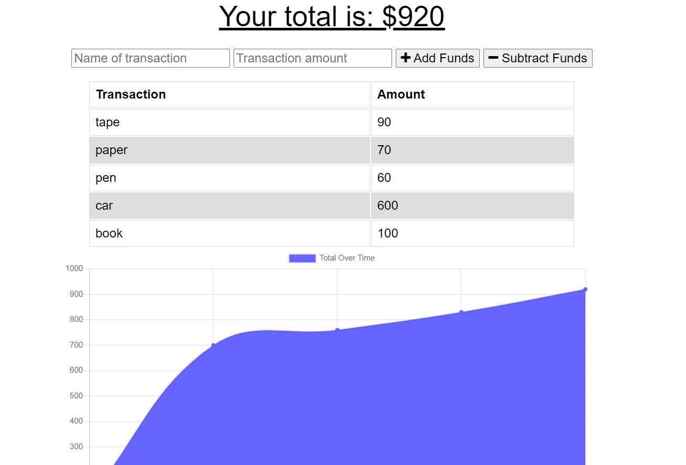

# Budget Tracker

## User Story

As a user, I want to be able to track my withdrawals and deposits with or without a data/internet connection so that my account balance is accurate when I am traveling.

## Description

This app allows a user to keep track of their spending by helping them record their deposits and withdrawal and displaying it as a graph.

## Installation

To make use of this app after cloning the github page run the following commands on you command line

    1)npm i
    2)nodemon server.js

## Deployment

This app was deployed on Heroku click on this link to use the app
[Budget Tracker](https://desolate-sierra-09390.herokuapp.com/)

## Usage

When the app is launched You will see two input boxes for Name of transaction and Transaction amount. These input boxes are where you will write whether you made a deposit or a withdrawal and then the amount. Then you press either of the two button besides the input boxes as to whether to add to the funds or subtract from the funds.
The information of the transaction is then displayed and the graph is drawn.

## License

